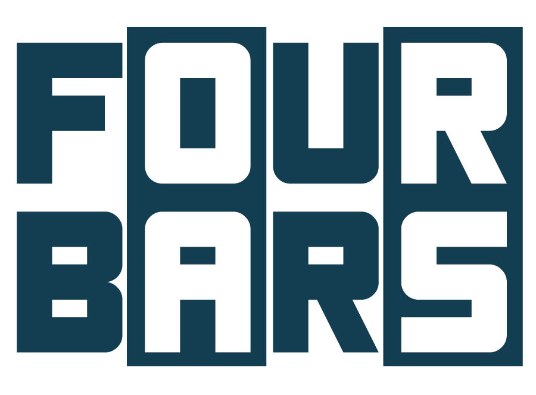
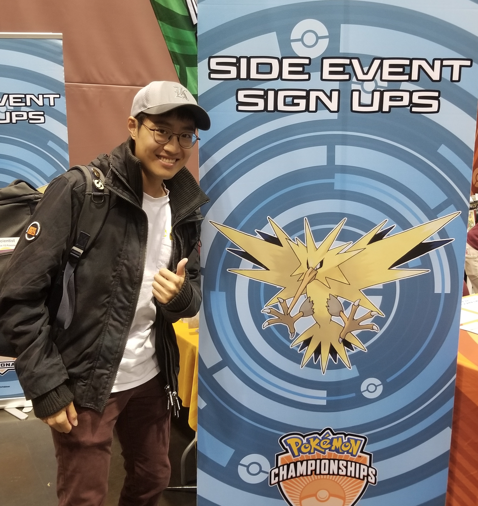
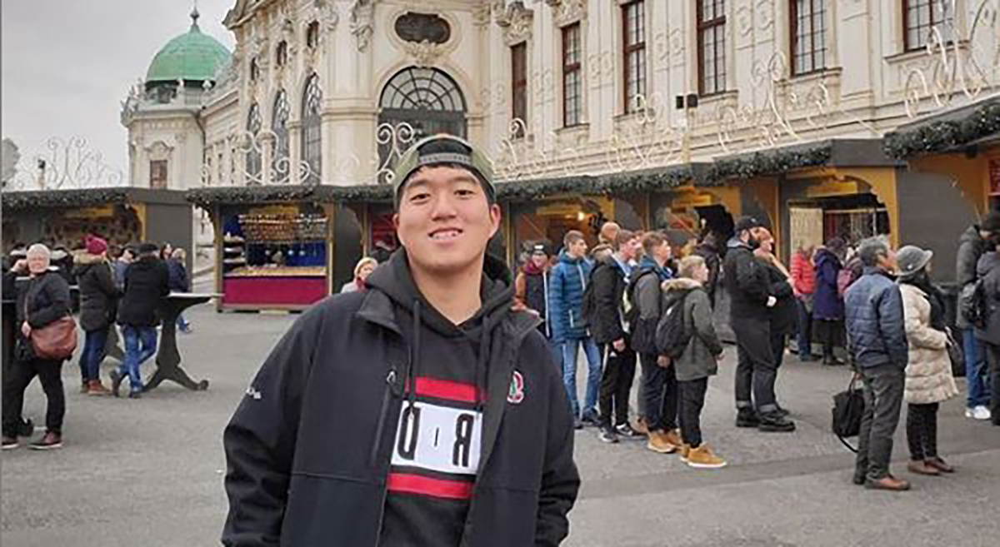

# Four Bars

### Team Logo

### Team Members
Jihun Hong

Jonathan Kim

Collin Kwon

Jin Woo Yu

### Project Synposis

### Contact
Email:
{hjihun, jonkim95, ynkwon, jinwooyu}@stanford.edu

### Team skills matrix
Member | Skills | Hat | Personal Traits | Desired Growth | Weaknesses
--- | --- | --- | --- | --- | ---
Jihun | Programming, AI, GUI skills | Yellow | Optimistic and abstractive thinking | Javascript | Bad long-term memory
Jonathan | AI, NLP, scripting | White | Pragmatic, adaptive, humorous | Frontend, full-stack project development | Big picture thinking
Collin | React, Ethereum | White | Abstract Thinker | Programming, Backend | Backend
Jinwoo | UI/UX Design, prototyping, project management | Red | Organized, Strong Opinions, Emotional | Programming | Programming
