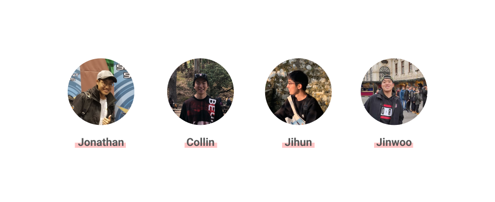

# Four Bars

### Team Members

### Project Synposis
Our project is a university campus tour guide-tourist matchmaking platform. Every year, thousands of families and students visit college campuses, in the hopes that they themselves or their children would find a school that would best fit their interests. 

Many of them have varying fields of interest - some might be more interested in the life of an engineering student, while others would love to hear more about what the school's arts program has to offer. Some tourists might require different accomodations than others - a family with parents that do not speak English might prefer to talk with a student that speaks their language. 

We, the Four Bars team, plan on creating a platform where campus tourists can find the perfect tour guide. This service would enable customzied school tours conducted by real students, and allow for a customized tour experience.

### Contact
Email:
{hjihun, jonkim95, ynkwon, jinwooyu}@stanford.edu

### Team skills matrix
Member | Skills | Hat | Personal Traits | Desired Growth | Weaknesses
--- | --- | --- | --- | --- | ---
Jihun | Programming, AI, GUI skills | Yellow | Optimistic and abstractive thinking | Javascript | Bad long-term memory
Jonathan | AI, NLP, scripting | White | Pragmatic, adaptive, humorous | Frontend, full-stack project development | Big picture thinking
Collin | React, Ethereum | White | Abstract Thinker | Programming, Backend | Backend
Jinwoo | UI/UX Design, prototyping, project management | Red | Organized, Strong Opinions, Emotional | Programming | Programming
